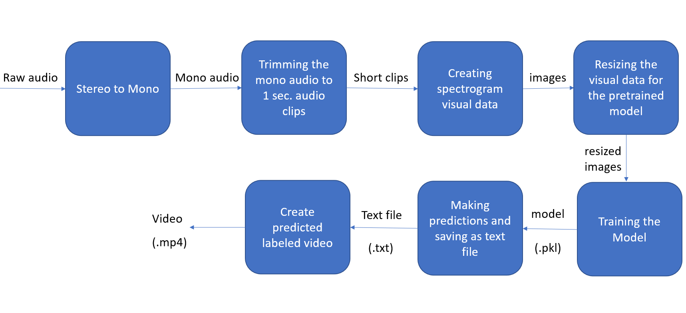
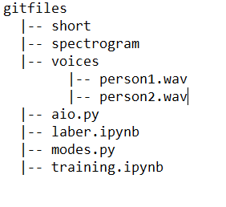
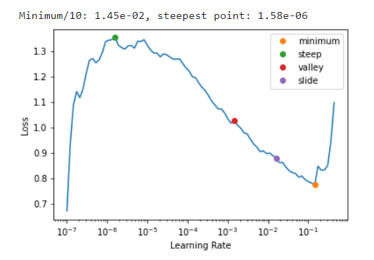
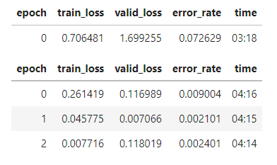
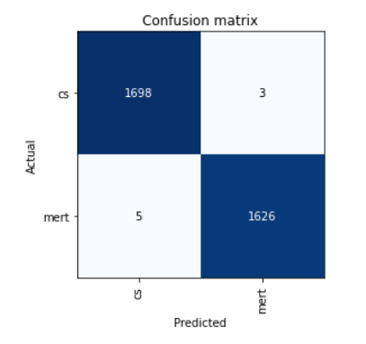

# Human-Voice-Classification
Voice Identification and Labeling based on mono audio Spectrogram Data


## What is Human Voice Recognition?
Analyzing and learning the person's specific voice and using it to fine-tune the recognition of that person's speech.

You can visit [this page](https://www.macmillandictionary.com/dictionary/british/voice-recognition) for the dictionary definition.

## Installation
I would recommend to download this repository for better workspace in command-line.

## Demo
[](https://www.youtube.com/watch?v=aJP5xogUpQg)

This demo is a demonstration for 2-Class speech-Recognition. It showcases the labeled conversation between two of my personal favored Influencers.

It has been trained with total of 4 hours audio clip and 16300 spectrogram image data.

## How it works?
The model, which is a "Deep Residual Learning for Image Recognition" looks at the voice classes based on given spectrogram image datas, that has been preprocessed.

Then for the real test Phase, the model makes predictions for the given .wav file and overlays the prediction to the corresponding video.



## How to prepare the necessary data?

Before running the scripts it is better to use the following directorial tree:



Since we will be running the scripts from command line, we should go to the directory of this repository on the computer. For me it was

```bash
cd desktop/proje
```

1. Now we can start off with converting the stereo .wav file to mono .wav file.
In this way we've halved the size of .wav file.
Besides that the parameters that give us spacial information are now eliminated, thus we have a better chance to prevent any overlocalization. (This is the part i'm not sure about if this kind of eliminition makes any sence)

```bash
python modes.py -m voice/person1.wav
```

2. Then we crop the mono .wav file to 1 second long audio clips

```bash
python modes.py -t voice/person1.wav -p person1
```
3. Now we create some visual data

```bash
python modes.py -v person1 -a voice/person1.wav
```
4. Finally we resize the visual datas to 224x224 so that we can have a constant size. Other than that for the sake of finetuning it is also good to use the same size what the model was originally using

```bash
python modes.py -r person1
```

## Training the model

The training Phase is quite self explanatory. We finetune a pretrained model called "resnet50" with using fastai and pytorch libraries. Details are in training.ipynb

1. We load the spectrogram data folder path and give a batch size(bs=32)

2. After that we download the Resnet50 model and initiate it.

3. We get the best Learning Rate



4. Then we finetune the model



5. Finally we plot the confusion Matrix, save the model and save the predictions for the target .wav file



## Writing predictions on the video
Now we join the prediction with corresponding video for given duration

```bash
python modes.py -l compare.mp4 -lt compare.txt -ld 119
```
## Command explanation

-m for mono -- give the directory of .wav file (overwrites on the existing stereo file)

-t for trim (it has to be used with -p) -- give the directory of .wav file

-p for the name of the person

-v for visual (it has to be used with -a) -- give the name of the person who you want to create it's visual data

-a for audio -- give the directory of .wav file

-r for resize -- give the name of the person

-l for labeling -- give the directory of the .mp4 file (it has to be used with -lt and -ld)

-lt for labelingtext -- give the directory of the .txt file that has predictions

-ld for labeling duration -- give the duration, which you want it to be rendered.

(The video won't be saved as _temp_.mp4 if you are't using jupyter Notebook)

Created by Can Günen
